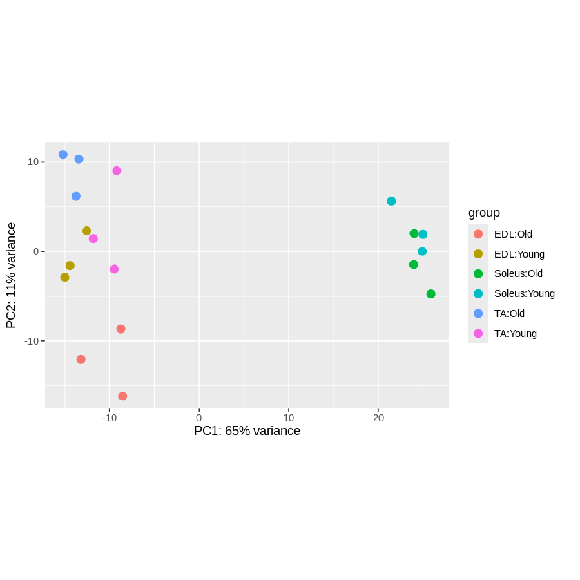
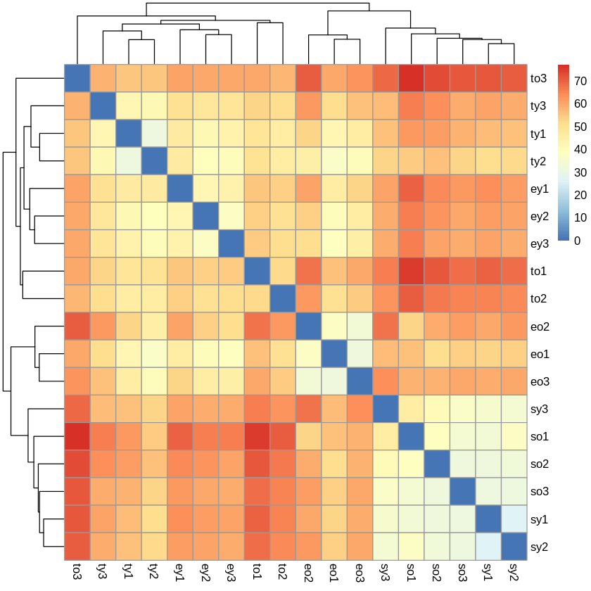

# Skeletal Muscle Aging — Comparative Bulk RNA-seq Case Study

An end-to-end public-data case study comparing aging-associated transcriptional changes across mouse EDL, soleus, and tibialis anterior muscle.

## Why this project matters

Aging does not affect every skeletal muscle in the same way. This analysis asks whether bulk RNA-seq can reveal muscle-specific susceptibility, preserved responses, and pathway changes relevant to sarcopenia research.

The repository demonstrates how I structure a transcriptomics project for a wet-lab team: quality control, a defined statistical comparison, interpretable figures, functional enrichment, and a concise biological report.

## Study at a glance

| Item | Details |
|---|---|
| Dataset | GEO GSE287832 |
| Organism | *Mus musculus* |
| Design | Young versus aged; EDL, soleus, and tibialis anterior |
| Samples | 18 total; 3 biological replicates per muscle-age group |
| Differential expression | DESeq2; adjusted *p* < 0.05 and \|log2 fold change\| > 1 |
| Downstream analysis | PCA, sample-distance heatmap, differential expression, GO enrichment, and cross-muscle comparison |

## Quality-control overview

| PCA | Sample-distance heatmap |
|---|---|
|  |  |

These plots are used to assess the dominant sources of variation and the consistency of biological replicates before interpreting differential expression.

## Key results

| Muscle | Significant genes | Interpretation from this analysis |
|---|---:|---|
| EDL | 1,129 | Strongest aging-associated transcriptional remodeling |
| Soleus | 44 | Comparatively limited disruption in this dataset |
| Tibialis anterior | 105 | Intermediate response with retained muscle-adaptation signals |

Enrichment results highlighted muscle-development, TGF-beta, growth-regulation, apoptotic, extracellular-matrix, angiogenesis, and activity-response programs. These are exploratory results from a public dataset and should be interpreted alongside the original study design and independent biological validation.

## Analysis workflow

1. Import count data and metadata.
2. Apply variance-stabilizing transformation.
3. Review PCA and sample-distance structure.
4. Fit age contrasts within each muscle using DESeq2.
5. Compare significant-gene counts and effect patterns across muscles.
6. Perform Gene Ontology enrichment with `clusterProfiler`.
7. Summarize the evidence and limitations in a research-facing report.

## Navigate the analysis

- [Data import and quality control](notebooks/01_data_import_qc.ipynb)
- [Differential-expression analysis](notebooks/02_differential_expression.ipynb)
- [Functional-enrichment analysis](notebooks/05_functional_enrichment_analysis.ipynb)
- [Cross-muscle comparison](notebooks/06_cross_muscle_comparison.ipynb)
- [Case-study report](report/Aging_Muscle_Case_Study_Report.md)

## Tools

R, DESeq2, `clusterProfiler`, `enrichplot`, `pheatmap`, `ggplot2`, and `dplyr`.

## Portfolio note

This is a public-data portfolio analysis, not client work. It is intended to demonstrate analytical reasoning, reproducible organization, and communication of results without exposing confidential data.

## Work with me

I support wet-lab groups with bulk RNA-seq and single-cell analysis, reproducible workflows, biological interpretation, and manuscript-ready figures.

- [Omics Flow Lab](https://omicsflowlab.netlify.app/)
- [LinkedIn](https://www.linkedin.com/in/akshat-jaiswal-i-omics-flow-lab-9234b5384/)
- [omicsflow.lab@gmail.com](mailto:omicsflow.lab@gmail.com)
